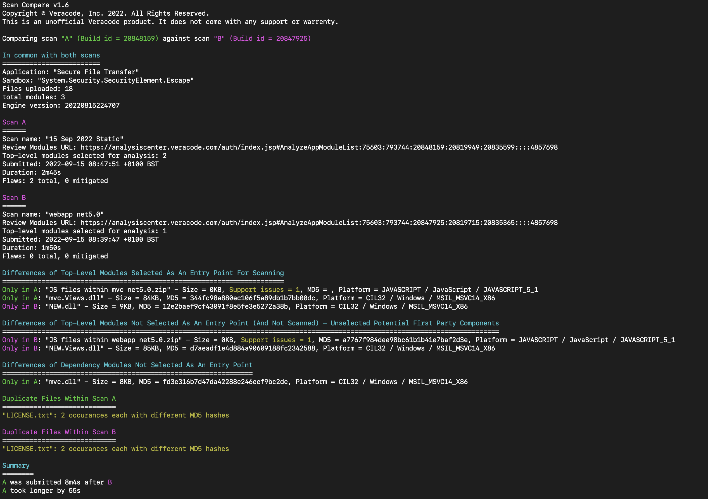

# Veracode Scan Compare

This is an unofficial Veracode product. It does not come with any support or warrenty.

Use this tool to compare two Veracode scans.

## Usage

We recommend you configure a Veracode API credentials file as documented here: https://docs.veracode.com/r/c_configure_api_cred_file.

Alternatively you can use environment variables (`VERACODE_API_KEY_ID` and `VERACODE_API_KEY_SECRET`) or CLI flags (`-vid` and `-vkey`) to authenticate with the Veracode APIs.

```
./scan_compare -h
Scan Compare v1.x
Copyright © Veracode, Inc. 2022. All Rights Reserved.
This is an unofficial Veracode product. It does not come with any support or warrenty.

Usage of scan_compare:
  -a string
        Veracode Platform URL or build ID for scan "A"
  -b string
        Veracode Platform URL or build ID for scan "B"
  -region string
        Veracode Region [global, us, eu]
  -vid string
        Veracode API ID - See https://docs.veracode.com/r/t_create_api_creds
  -vkey string
        Veracode API key - See https://docs.veracode.com/r/t_create_api_creds
```

## Example Usage

```
./scan_compare -a https://analysiscenter.veracode.com/auth/index.jsp#StaticOverview:75603:793744:22132159:22103486:22119136::::5000002 -b https://analysiscenter.veracode.com/auth/index.jsp#StaticOverview:75603:793744:22131974:22103301:22118951::::4999988
```

If you know the build IDs you can use them instead of URLs like so:

```
./scan_compare -a 22132159 -b 22131974
```

## Example Output



## Development

### Running

```
go run *.go
```

### Compiling

```
./release.sh
```